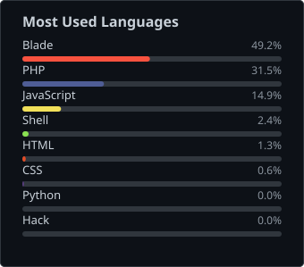

<h1> Hey! I'm Al Amin Mishu</h1>

## 📑 Quick Links

[About Me](#-about-me) · [What I Bring](#-what-i-bring) · [Tech Stack](#-tech-stack) · [GitHub Metrics](#-github-metrics) · [Contribution Graph](#-contribution-graph) · [Connect](#-connect-with-me)

---

## 👨‍💻 About Me

🚀 Senior Software Engineer at [Walton Hi-Tech Industries PLC](https://waltonplaza.com.bd)  
🔧 E-commerce Microservices Enthusiast with 8+ years of experience  
🧰 Proficient in Laravel, React, Docker, Kubernetes, and DevOps  
📦 Specialized in building scalable, distributed systems and RESTful APIs  
🎯 Focused on clean architecture, domain-driven design (DDD), and test-driven development (TDD)  
🌍 Passionate about system design, performance optimization, and open-source contribution  
🎯 **Career Mission:** To lead engineering teams that build high-impact, scalable platforms—blending performance, usability, and innovation to drive business growth.

---

### 💡 What I Bring

- 🏗️ **Architecture & Design** — Modular, loosely-coupled microservices with clear domain boundaries (DDD) that scale independently.
- ✅ **Quality Culture** — Test-driven development, disciplined code review, and CI/CD pipelines that catch problems before production.
- ⚡ **Performance-Minded** — Profiling, caching (Redis), query tuning, and horizontal scaling for high-traffic e-commerce workloads.
- 🤝 **Team Enablement** — Documenting decisions, pairing on hard problems, and favoring maintainable code over clever code.
- 🔭 **Currently Focused On** — Platform reliability, observability, and Kubernetes-native deployment patterns.

---

### 🛠️ Tech Stack

---

### 📊 GitHub Metrics

⚠️ Why did stats / trophies / WakaTime / languages go blank?

 

Checked every widget directly, not a guess:

| Widget | Root cause | Fix |
|---|---|---|
| GitHub Stats card | `github-readme-stats.vercel.app` → `503 DEPLOYMENT_PAUSED` (maintainer's own Vercel deployment down, not GitHub) | Self-hosted: `github-metrics.svg`, regenerated every 6h |
| Top Languages card | Same dead deployment as above, *and* the self-hosted `lowlighter/metrics` languages plugin independently returned an empty panel with no error for this account | Replaced with a ~120-line script (`.github/scripts/top_languages.py`) that pulls `GET /repos/{owner}/{repo}/languages` per repo and renders the chart directly — no third-party plugin in the loop |
| WakaTime card | Same dead deployment, plus was never actually configured — the file still had `<!-- Replace this with your WakaTime username -->` | Removed |
| Trophies | `github-profile-trophy.vercel.app` → `402 DEPLOYMENT_DISABLED` | Removed |
| Achievements panel | `lowlighter/metrics`'s own GraphQL query hard-fails with `Projects (classic) is being deprecated` — GitHub is sunsetting that API, upstream bug, not fixable from this repo | Dropped, swapped for a full-year isometric contributions calendar instead |

Nothing here waits on someone else's uptime: [`metrics.yml`](.github/workflows/metrics.yml) and [`snake.yml`](.github/workflows/snake.yml) regenerate everything on a schedule and commit static SVGs straight into this repo. The streak card above is the one exception left pointing outward — confirmed healthy (`200`) at `streak-stats.demolab.com`.

---

### 🐍 Contribution Graph

<picture>
  <source media="(prefers-color-scheme: dark)" srcset="https://raw.githubusercontent.com/alaminmishu/alaminmishu/output/github-contribution-grid-snake-dark.svg" />
  <source media="(prefers-color-scheme: light)" srcset="https://raw.githubusercontent.com/alaminmishu/alaminmishu/output/github-contribution-grid-snake.svg" />
  
</picture>

*Rendered nightly by [`.github/workflows/snake.yml`](.github/workflows/snake.yml) and committed as a static SVG to the `output` branch — no live third-party dependency, no rate limits, no blank badges.*

---

### 📫 Connect with Me

---

  

